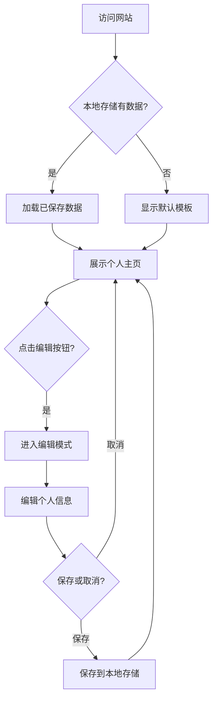

# 产品需求文档 (PRD)

## 1. 产品概述

这是一个个人主页网站，用户可以在网页上展示个人信息，并且可以实时在线编辑更新自己的信息。主要解决用户需要一个简洁、美观的个人展示页面，并能方便地维护和更新个人信息的需求。

**目标用户**: 需要展示个人信息的用户，如求职者、自由职业者、创作者等。

## 2. 核心功能

### 2.1 功能模块

1. **个人主页展示页面**: 个人头像、姓名、职位、简介、技能标签、联系方式、社交链接
2. **编辑模式页面**: 表单编辑所有个人信息，实时预览

### 2.2 页面详情

| 页面名称 | 模块名称 | 功能描述 |
|---------|---------|---------|
| 个人主页 | 头像区域 | 展示圆形头像，悬停有动画效果 |
| 个人主页 | 基本信息 | 姓名、职位、个人简介 |
| 个人主页 | 技能标签 | 展示技能列表，标签样式 |
| 个人主页 | 联系方式 | 邮箱、电话、地址等信息 |
| 个人主页 | 社交链接 | GitHub、LinkedIn、微博等链接 |
| 个人主页 | 编辑按钮 | 切换到编辑模式的入口 |
| 编辑模式 | 表单编辑 | 编辑所有个人信息的表单 |
| 编辑模式 | 保存/取消 | 保存或取消编辑的按钮 |

## 3. 核心流程

用户首次访问网站时，看到展示页面，展示默认或已保存的个人信息。点击编辑按钮后，进入编辑模式，可以修改所有个人信息。编辑完成后点击保存，信息更新并返回展示页面。所有数据保存在浏览器本地存储中。

## 4. 用户界面设计

### 4.1 设计风格

- **主色调**: 现代渐变蓝紫色调（#6366f1 到 #8b5cf6），配合深色背景
- **次要色调**: 白色/浅灰色用于文字和卡片
- **按钮样式**: 圆角按钮，带有悬停动效和渐变背景
- **字体**: 使用 Outfit 作为标题字体，Source Sans 3 作为正文字体
- **布局**: 居中卡片式布局，响应式设计
- **动画**: 卡片悬停效果、按钮过渡动画、平滑切换效果

### 4.2 页面设计概览

| 页面名称 | 模块名称 | UI元素 |
|---------|---------|--------|
| 个人主页 | 头像区域 | 圆形头像，带阴影和边框装饰 |
| 个人主页 | 基本信息卡片 | 毛玻璃效果背景，圆角卡片 |
| 个人主页 | 技能标签 | 彩色药丸标签，悬停放大 |
| 个人主页 | 联系方式 | 图标+文字列表，点击可复制 |
| 个人主页 | 社交链接 | 圆形图标按钮，悬停旋转效果 |
| 编辑模式 | 表单 | 输入框带标签，圆角设计 |
| 编辑模式 | 按钮 | 主按钮（保存）和次要按钮（取消） |

### 4.3 响应式设计

- 桌面优先设计，支持移动端适配
- 大屏幕（>1024px）: 居中卡片，宽度固定600px
- 平板和手机（<1024px）: 全宽卡片，内边距调整
- 触摸优化：按钮和链接有足够的点击区域

### 4.4 交互细节

- 头像悬停：轻微放大和旋转效果
- 技能标签悬停：放大和阴影效果
- 社交链接悬停：旋转和颜色变化
- 编辑/保存切换：平滑过渡动画
- 复制成功提示：Toast通知提示