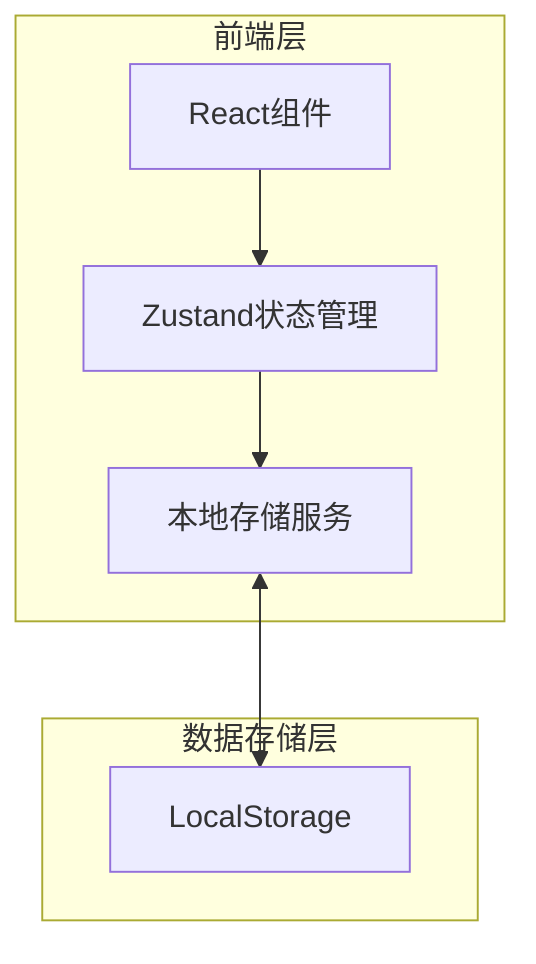

# 技术架构文档

## 1. 架构设计



## 2. 技术说明

- **前端框架**: React 18 + TypeScript
- **样式方案**: Tailwind CSS 3
- **构建工具**: Vite
- **状态管理**: Zustand（轻量级状态管理）
- **数据持久化**: LocalStorage（浏览器本地存储）
- **图标库**: Lucide React

## 3. 路由定义

| 路由 | 用途 |
|-----|-----|
| `/` | 个人主页展示（默认页面） |
| `/edit` | 编辑模式页面 |

## 4. 数据模型

### 4.1 个人信息数据结构

```typescript
interface PersonalInfo {
  avatar: string;           // 头像URL
  name: string;              // 姓名
  title: string;             // 职位/头衔
  bio: string;               // 个人简介
  skills: string[];          // 技能列表
  email: string;             // 邮箱
  phone: string;             // 电话
  location: string;          // 所在地
  socialLinks: SocialLink[]; // 社交链接
}

interface SocialLink {
  platform: string;  // 平台名称
  url: string;       // 链接地址
  icon: string;      // 图标名称
}
```

### 4.2 本地存储键名

```typescript
const STORAGE_KEY = 'personal-portfolio-data';
```

## 5. 项目结构

```
src/
├── components/          # 可复用组件
│   ├── Avatar.tsx       # 头像组件
│   ├── SkillTag.tsx     # 技能标签组件
│   ├── ContactItem.tsx  # 联系方式项组件
│   ├── SocialLink.tsx   # 社交链接组件
│   └── Toast.tsx        # 提示消息组件
├── pages/               # 页面组件
│   ├── Home.tsx         # 个人主页展示页面
│   └── Edit.tsx         # 编辑模式页面
├── store/               # 状态管理
│   └── useStore.ts      # Zustand store
├── utils/               # 工具函数
│   └── storage.ts       # 本地存储操作
├── types/               # TypeScript类型定义
│   └── index.ts
├── App.tsx              # 应用入口
└── main.tsx             # 渲染入口
```

## 6. 核心功能实现

### 6.1 数据持久化

使用 LocalStorage 存储用户数据，页面加载时自动读取，编辑保存时自动写入。

### 6.2 状态管理

使用 Zustand 管理全局状态，包括：
- 个人信息数据
- 编辑模式状态
- Toast 提示状态

### 6.3 组件设计

采用组件化设计，每个功能模块独立为可复用组件，便于维护和扩展。

## 7. 默认数据

系统将提供一套默认的示例数据，用户首次访问时展示默认模板，之后可自由编辑。